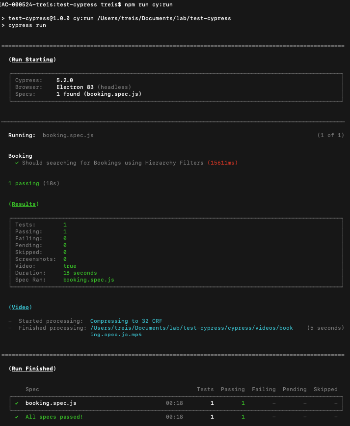

# Example - How To Use Cypress Tool For Creating Automated Tests

## Motivation
- This project was created to simulate automated tests in the [Micro Frontend](https://github.gapinc.com/production/react-mfe-template) project, using Cypress testing tool.

## Project Structure

``` bash
├── cypress - Package managed by the Cypress
│   ├── fixtures - All the stubs should be stored here
│   ├── integration - Package with the automated tests files
│   └── ...
├── package.json 
└── cypress.json - Config file: https://docs.cypress.io/guides/references/configuration.html
```

## Pre-requisites
1. The Node version used in this project is 14.10.0. Maybe you can have some issues during `npm install` using an old version (< 14.0.0);
2. As the Cypress is a Desktop application, you need to install the Cypress locally using this command:
    - `$ npm install cypress --save-dev`
    - Reference: https://docs.cypress.io/guides/getting-started/installing-cypress.html#npm-install
3. Install the project's dependencies in the local node_modules folder:
    - Run `$ npm install`

## How To Guides  

### How to run the tests manually via Cypress UI?
- Execute this command: `$ npm run cy:open`. 
- Note: This command will display all automated test files existing in the `integration` folder. So, you can select manually the test that you want to run.
- https://docs.cypress.io/guides/guides/command-line.html#cypress-open 

### How to run all the tests?
- Execute this command: `$ npm run cy:run`
- Note: This command will run all tests headlessly in the Electron browser. 
- https://docs.cypress.io/guides/guides/command-line.html#cypress-run

### Screenshots
- When you execute `$ npm run cy:open` and select one automated test to run:
- 


- When you execute `$ npm run cy:run`:
- 

### References
- API: https://docs.cypress.io/api/api/table-of-contents.html
- Mocking the responses: https://docs.cypress.io/guides/guides/network-requests.html#Stubbing
- Examples: https://github.com/cypress-io/cypress-example-recipes/tree/master/examples